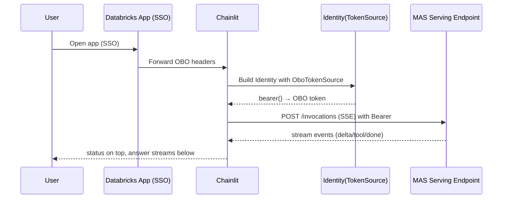
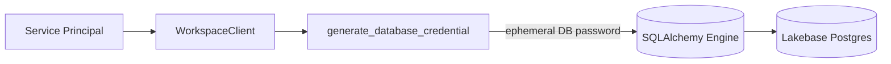

# BI Hub App — AI-Powered Business Intelligence Agent

A Databricks App built with Chainlit that provides an intelligent chat interface for BI analytics. Users pick between two agent modes from a dropdown:

- **Genie One (Direct)** — an in-app reasoning agent (OpenAI Agents SDK on a Databricks Foundation Model) that talks to a single Genie Space through the managed **Genie MCP** server. This is the default agent.
- **BI Supervisor (MAS)** — a Multi-Agent Supervisor serving endpoint that routes across multiple Genie Spaces and Knowledge Assistants.

Session state and chat history are persisted in **Lakebase (PostgreSQL)**.


## Key Features

**Chainlit Implementation**
- **Two selectable agents**: Genie One (direct, in-app reasoning + Genie MCP) and BI Supervisor (MAS endpoint), switchable from the Chat Settings dropdown.
- **Durable, self-owned schema**: On startup the app service principal creates (and therefore owns) its own Chainlit tables in Lakebase, so schema access survives `bundle deploy` without manual grants (see *Durable schema* below).
- **Persistent Chat History**: Lakebase (PostgreSQL) via the Chainlit SQLAlchemy Data Layer for session and chat persistence.
- **Customizable UI**: Minimal Chainlit interface with easy branding customization (`theme.json` + `custom-branding.css`).
- **Real-time Streaming**: Responses stream directly to users for immediate feedback.

**Databricks Integration**
- **Genie MCP (Genie One)**: The in-app agent calls the managed Genie MCP server (`/api/2.0/mcp/genie/{space_id}`) using the user's OBO token (requires the `genie` OBO scope + `CAN_RUN` on the space).
- **Multi Agent Supervisor (MAS)**: Routes queries across Genie Spaces and Knowledge Assistants for consolidated responses.
- **Secure Model Access**: Leverages OBO (On-Behalf-Of) tokens to query Model Serving endpoints and Genie requests.
- **Unity Catalog Integration**: Applies table, row, and column-level security through Unity Catalog permissions.
- **Lakebase (Postgres)**: Stores session state and chat history.
- **Comprehensive Logging**: MAS traces logged via MLflow 3.0 and can be loaded into Delta tables.


*Both agent paths are shown: **Genie One (Direct)** (Chainlit app → OBO/`genie` scope → reasoning agent → Genie MCP → Genie Space) and **BI Supervisor (MAS)** (→ MAS endpoint → Genie/KA agents). Diagram source is `src/app/public/images/architecture.d2` (editable, Databricks-themed); a dark variant is at `architecture-dark.svg`.*


## Example (SAMPLE DUMMY DATA)


## Quick Start

**Deploy with Databricks Asset Bundles:**
```bash
git clone <repo-url>
cd bi-hub-app
# 1. Configure databricks.yml + src/app/app.yaml (see "Key files" below)
databricks bundle validate --profile <PROFILE>
databricks bundle deploy   --profile <PROFILE>   # provisions the Lakebase instance + app
# 2. Run the setup job BEFORE first app use. It creates the Chainlit tables and,
#    critically, GRANTs CREATE ON SCHEMA public to the app service principal so
#    the app can create/own its schema on startup.
databricks bundle run setup_lakebase --profile <PROFILE>
# 3. Deploy the app source
databricks apps deploy bi-agent --source-code-path <workspace-files-path>/src/app --profile <PROFILE>
```

Notes:
- `bundle deploy` re-provisions the app's Lakebase role binding. Because the app SP **owns** its Chainlit tables (created at startup by `ensure_schema()`), that ownership survives redeploys — no manual re-grant of table privileges is needed. See *Durable schema*.
- `.chainlit/` is a dot-directory; `databricks.yml` uses `sync.include: src/app/.chainlit/**` so the Chainlit config (branding, custom CSS, logo) actually ships. Without that include, `databricks sync` silently drops it and the UI falls back to defaults.

**Key files to configure before deploying:**
- `databricks.yml` — app name, Lakebase instance name, serving endpoint var, workspace user. Host comes from the CLI profile at deploy time.
- `src/app/app.yaml` — canonical env vars (`SERVING_ENDPOINT`, `GENIE_SPACE_ID`, `DATABASE_INSTANCE`, `AVAILABLE_AGENTS`, `REASONING_MODEL`, `CHAINLIT_AUTH_SECRET`). The committed file is de-branded with `<placeholders>`; set real values per deployment. For a zero-setup demo, build a Genie Space on `samples.nyctaxi.trips` (the `samples` catalog ships with every workspace) and use its id for `GENIE_SPACE_ID`.
- `src/app/.chainlit/config.toml` — Chainlit settings, `custom_css` (must be an absolute `/public/...` path), branding.
- `src/app/public/logo_light.svg` + `logo_dark.svg` — your logo (Chainlit's `/logo` endpoint loads these by filename convention, per theme). `favicon.ico` for the tab icon.
- `AVAILABLE_AGENTS` (JSON in app.yaml) — the **first** entry is the session default. Genie One is listed first by default.

**Local Development:**
```bash
cd src/app
pip install -r requirements.txt
# Set env vars: DATABRICKS_TOKEN, PGHOST, SERVING_ENDPOINT, etc.
chainlit run app.py -w
```

**Authentication Notes:**
- **Databricks Apps**: Uses OBO/SSO (configured via environment variables in app.yaml)
- **Local Dev**: Uses password auth + PAT (set `DATABRICKS_TOKEN` environment variable)

**What you get:**
- Streaming responses from MAS
- Tool calls in status block (above)
- Tables auto-formatted from pipe-tables
- Chat history persisted in Lakebase

## Auth & Transport (at a glance)

| Context | MAS Auth | Transport | Lakebase Auth |
|---------|----------|-----------|---------------|
| Databricks App | OBO | SSE to `/invocations` (REST) | Service Principal |
| Local Development | PAT | OpenAI Async client (`responses.*`) | Service Principal |

**Known 403s (two distinct causes):**
- **MAS via OpenAI SDK + OBO** → "invalid scope" 403. Bypassed by querying the MAS endpoint directly (raw SSE) instead of the OpenAI client on OBO.
- **Genie MCP + expired OBO token** → OBO tokens live ~1 hour and are snapshotted at login. After idling, the stale token yields a 403 from the Genie MCP server. The app treats tokens within 120s of expiry as expired and shows a "session expired — refresh" prompt instead of a raw error. A page reload re-mints the token.

## What you get

- Streaming MAS responses
- Tool calls shown in a status block (always above)
- Tables auto-formatted when pipe-tables are detected
- Chat history persisted (resumable threads)

## Durable schema (app owns its tables)

The app's Lakebase database binding is `CAN_CONNECT_AND_CREATE`. On startup,
`memory/schema.py::ensure_schema()` connects **as the app service principal** and
runs idempotent `CREATE TABLE IF NOT EXISTS` (+ self-healing `ALTER TABLE ... ADD
COLUMN IF NOT EXISTS` for the Chainlit 2.11 `steps` columns). Because the app SP
*creates* the tables, it *owns* them — so when `bundle deploy` recreates the SP's
Postgres role, table access is intrinsic to ownership and is **not** wiped. This
replaces the fragile "owner = human + manual GRANTs" model that broke login on
every redeploy.

One-time prerequisite: the app SP needs `GRANT CREATE ON SCHEMA public` (it has
only `USAGE` by default, even with `CAN_CONNECT_AND_CREATE`). The setup job
(`src/scripts/setup_chainlit_lakebase.ipynb`) issues this grant; it runs as the
deploying human, who can grant it. The app SP cannot grant it to itself.

## Minimal Setup Notes

- **Chainlit config:** session timeouts, branding (`src/app/.chainlit/config.toml`, `public/logo_light.svg` / `logo_dark.svg`)
- **History budget (token-safe):** keep earliest system message + last N turns + a simple char budget; append current user message
- **Lakebase:** SP → `generate_database_credential` → ephemeral DB password (cached + auto-refresh), injected via SQLAlchemy connect hook

## Troubleshooting (quick)

- **401/403 to MAS in Apps** → OBO scope/expiry or endpoint ACLs
- **"password authentication failed" to Lakebase** → SP perms/expired cred (we auto-invalidate and refresh)
- **No streaming** → ensure OBO path uses SSE (`Accept: text/event-stream`) and payload key is `input=[...]` (not `messages`)
- **Local** → set `DATABRICKS_TOKEN` (PAT) and use OpenAI client path

**Enable debug:**
```bash
export CHAINLIT_DEBUG=true
```

## Diagrams

<details>
<summary><strong>Auth init & MAS call flow</strong></summary>



</details>

<details>
<summary><strong>Lakebase credential flow (no OBO)</strong></summary>



</details>

## Requirements (brief)

- Python 3.12
- Databricks CLI ≥ 0.267.0 (Apps)
- A Genie Space (for Genie One) and/or a MAS serving endpoint (for BI Supervisor) + a Lakebase instance
- App SP needs the `genie` OBO scope and `CAN_RUN` on the target Genie Space
- `requirements.txt` in `src/app` (pinned; note openai ≥ 2.45 / openai-agents ≥ 0.18.3 / pydantic ≥ 2.12)
